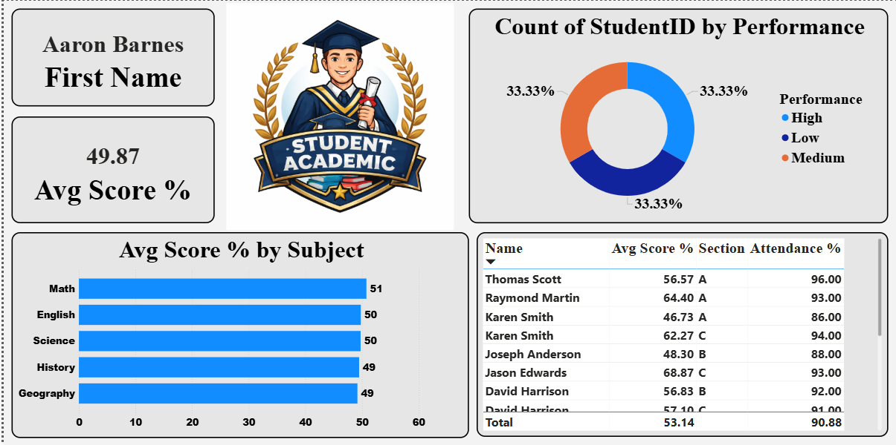
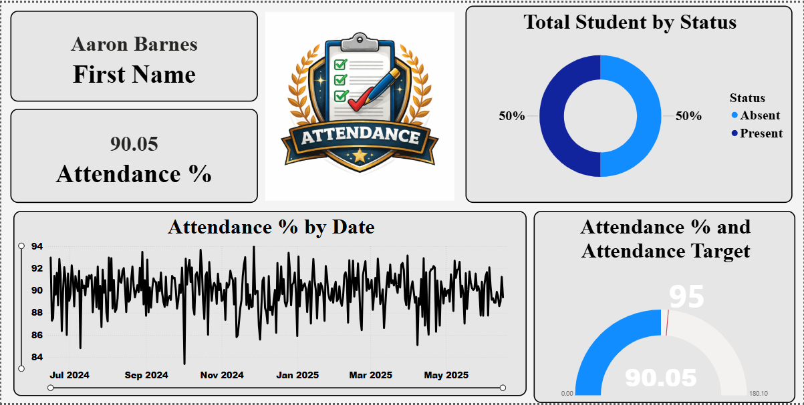
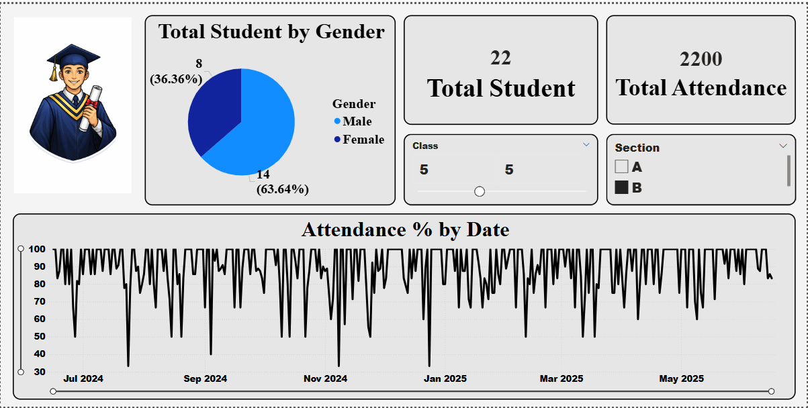
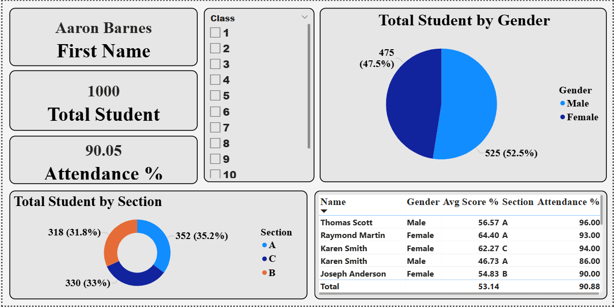

#  🎓 Bright Future School Analytics Dashboard  

  

  
  
  
  

---

# 📌 Project Overview

📊 This project is a **Student Performance & Attendance Analytics Dashboard** designed to analyze:

- 🎯 Academic performance  
- 📅 Attendance trends  
- 👥 Student demographics  
- 📊 Subject-wise scores  
- 🏫 Section & class distribution  

The dashboard provides **data-driven insights for schools** to improve student outcomes and decision-making.

---

# 📸 Dashboard Screenshots

## 📊 Academic Performance Analysis

🔍 **Description:**
- Displays subject-wise performance and overall scoring trends  

📊 **Key Metrics:**
- Avg Score: **49.87%**  
- Balanced performance across subjects  

### Insights:
- Math shows highest performance  
- English and Science are consistent  
- Slight improvement needed in History & Geography  

---

## 📅 Attendance Performance

🔍 **Description:**
- Tracks attendance trends over time  

📊 **Key Metrics:**
- Avg Attendance: **90.05%**  
- Target: **95%**  

### Insights:
- Attendance is stable but below target  
- Some fluctuations indicate irregular attendance periods  

---

## 👥 Student Overview

🔍 **Description:**
- Provides overall student distribution and demographics  

📊 **Key Metrics:**
- Total Students: **22 / 1000 (dataset variation)**  
- Gender Distribution: Nearly balanced  

### Insights:
- Male students slightly higher than female  
- Section distribution is evenly spread  

---

## 📘 Detailed Student Performance

🔍 **Description:**
- Individual student-level insights  

📊 **Features:**
- Student scores  
- Attendance %  
- Section details  

### Insights:
- High-performing students identified  
- Attendance strongly correlates with performance  

---

# 🎯 Objectives

✔ Analyze student academic performance  
✔ Track attendance trends  
✔ Identify high and low performers  
✔ Understand gender and section distribution  
✔ Improve decision-making for educators  

---

# 📊 Key Insights

📈 Average score is around **50%**  
📅 Attendance is high but below target  
👥 Gender distribution is balanced  
📊 Subject performance is consistent  
🎯 Attendance impacts academic performance  

---

# 🎨 Design & UI Highlights

### ✨ Visual Design
- Clean academic theme  
- Light background with structured layout  
- Icon-based visuals  

### 🧩 Layout Features
- Multi-dashboard structure  
- KPI cards for quick insights  
- Filters (Class, Section)  
- Clear data tables  

### 📊 Charts Used
- Bar charts → Subject analysis  
- Line charts → Attendance trends  
- Donut charts → Distribution  
- Tables → Student details  

---

# 🛠️ Tech Stack

| Tool | Purpose |
|------|--------|
| Power BI 📊 | Dashboard Development |
| Python 🐍 | Data Processing |
| Pandas 📈 | Data Analysis |
| DAX 📐 | Measures & KPIs |

---

# 📂 Dataset

📥 Student dataset with:
- Scores  
- Attendance  
- Class & section  
- Gender  

---

# 📈 Business / Educational Value

- Helps schools improve **student performance**  
- Tracks **attendance patterns**  
- Identifies **at-risk students**  
- Supports **data-driven teaching strategies**  

---

# 🚀 Future Enhancements

- 🤖 Predict student performance (ML)  
- 📊 Add teacher performance metrics  
- 📡 Real-time attendance tracking  
- 🎯 Personalized student insights  

---

## 👤 Author

**Tushar Vala**  
📊 Data Science Enthusiast  
🐍 Python | Pandas | Machine Learning  

